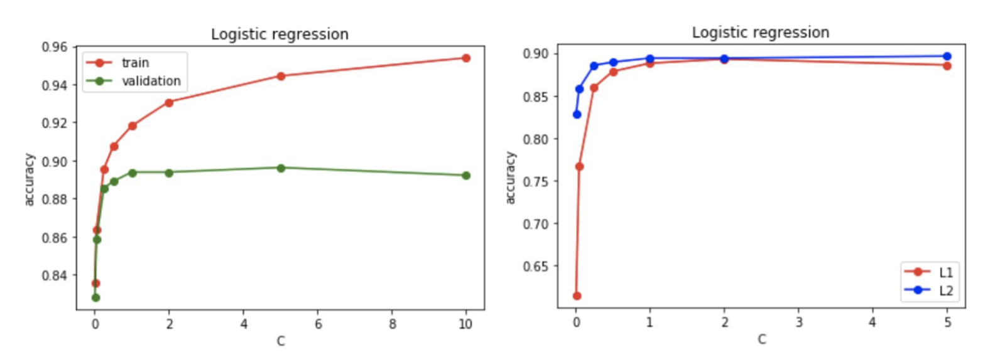
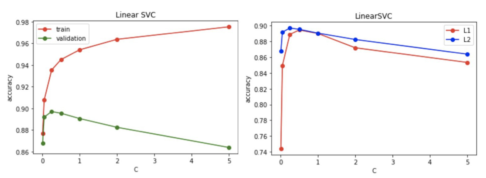
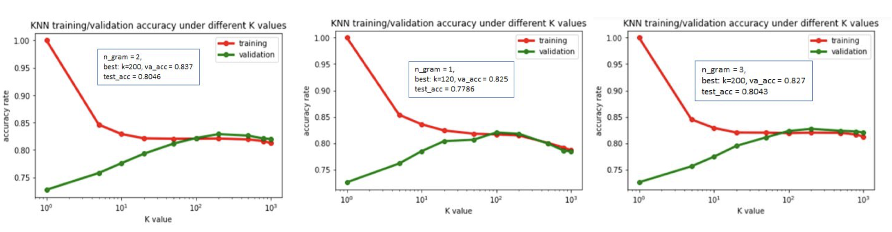
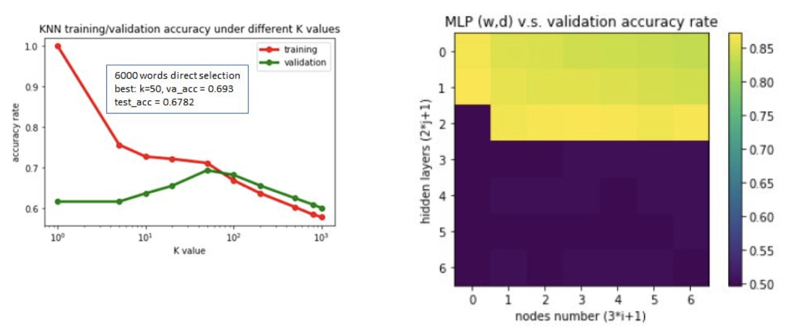
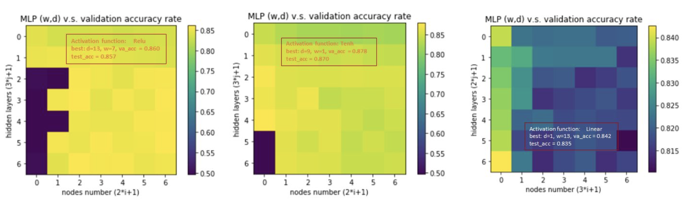
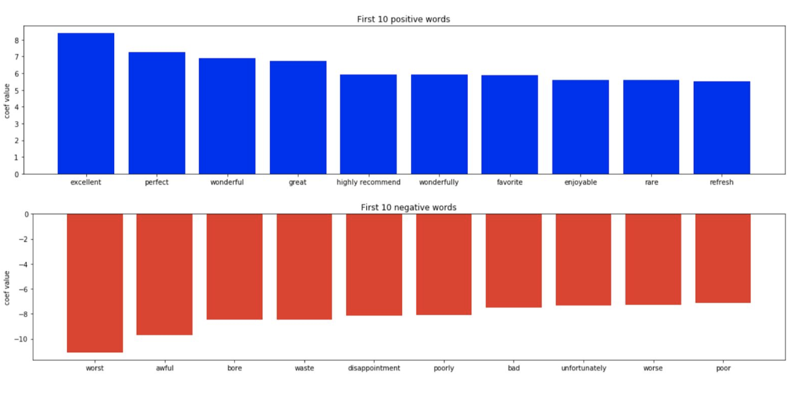
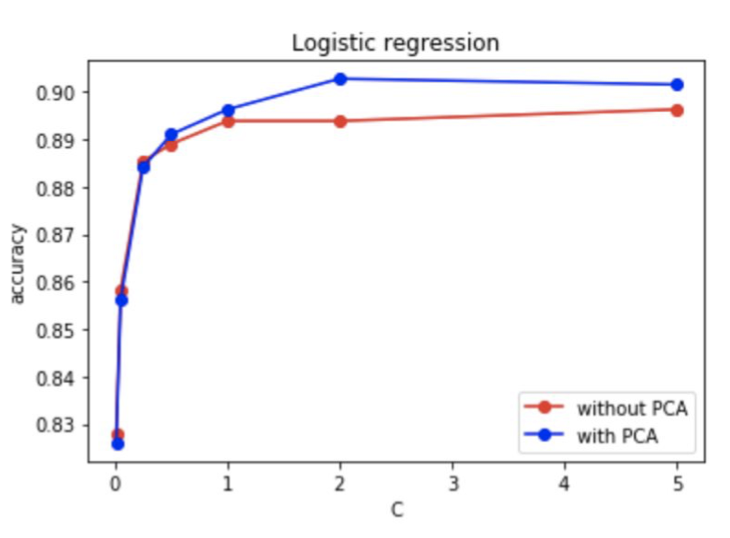
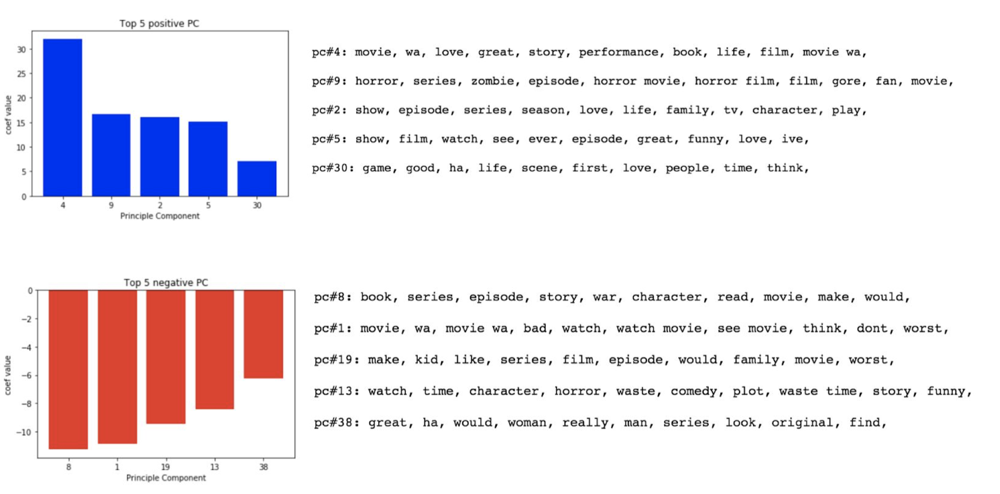

## Description

The dataset we use: <https://ai.stanford.edu/~amaas/data/sentiment/> contains 50000 movie reviews split evenly into 25000 train and 25000 test sets. Each review has a label of positive or negative. Our goal is to train a classification model that can tell whether a given movie review is positive or negative. We will split the training dataset into 9/10 train and 1/10 validation set. We will train several different models for the problem and for each model, we will choose one with the best performance on validation set and present it with the test set.

## Preprocessing

Before we start training our model, we need to clean up our raw text of the reviews since it may contain some messy stuff that is totally unrelated to the review. Moreover, there are "stop words" in the sentences that are used frequently for the grammar purpose but meaningless to the context. For example, by dropping out the stop words from the sentence, “It is a good story”, we get “good story”, which still can represent the meaning behind the texts. With this viewpoint, we remove those noisy stuff from the raw text to make our data more meaningful and easier to train. Below is our data preprocessing procedure:

1. Remove the html tags and punctuations.

2. Remove the “stop words”.

3. Lemmatize the words.

Lemmatization means transforming all the inflected forms of a word into the one that might look up in a dictionary. For example, the verb 'walk' may appear as 'walk', 'walked', 'walks', 'walking'. We lemmatize all these words to the basic form, ‘walk’. Note it is similar to stemming but lemmatization has the knowledge of the context. For instance, ‘better’ will be lemmatized to ‘good’ but stemming won’t. We use the external library, Natural Language Toolkit, to implement the data preprocessing procedure. Below is an example of the result done by our preprocessing procedure:

**Raw text:**

> Miss Eisenberg has developed from a cute face into a strong young actress with charm and wonderful comic delivery.   The story does a spectacular job in dealing with bullying, friendship, and fairness. It creates an opportunity to discuss these topics in an open and frank manner while recalling some "gross" scene from the film.

**Clean version text:**

> miss eisenberg ha develop cute face strong young actress charm wonderful comic delivery story doe spectacular job deal bully friendship fairness create opportunity discus topic open frank manner recall gross scene film

## Features Extraction

### Tf-idf

We need to have a strategy to transform a review into a vector of feature values. One intuitive way is to index all the words that occur in our dataset as the features and the value will be the occurring times in a review. However, we might underestimate the value of some words because of its rarity in the whole corpus and overestimate some words because of its popularity. With this aspect, we use tf-idf value as our feature value instead of occurring times. Tf-idf represents the product of the term-frequency and the inverse document-frequency. Below is the mathematical representation of the tf-idf value:
$$
tfidf = \frac{N_{i,j}}{N_{*,j}}log(\frac{D}{D_i})$
$$
$N_{i,j}$ - The number of times word i occurs in the review j.

$N_{*,j}$ - Total number of words in the review j.

$D$ - Total number of the reviews.

$D_i$ - Total number of the reviews that contains word i.

### N-gram

Sometimes, the information that a phrase provides is more than a word. For example, “must see” gives the stronger inference than the word “see”. N-gram is a contiguous sequence of n items from a given sample of text. After some rough experiments, we find phrase with up to 2-contiguous words can provide good enough performance. Hence, in our project, we stick with the n-gram range from 1 to 2.

We use the external library, Scikit-learn, to implement our features extraction. Note the original features size is approximately 80000 words (1-gram), which is too large to train in a short time. We also believe most of them are trivial to the classification result. Therefore, we take the first 6000 largest term-frequency words (including 1-gram and 2-gram) and calculate their tf-idf as our features.

## Model 1: Logistic Regression

We use `LogisticRegression()` model in sklearn library to implement. Note the optimization problem the model use is a little bit different from the one we learned from the course. Below is the cost function that the model optimize on (with L2 regularization):
$$
min_{\omega,c}\frac{1}{2}\omega^T\omega + C\displaystyle\sum_{i=1}^{n}log(exp(-y_i(X^T_i\omega+c))+1)
$$
In this model, it puts the penalty term, C, on the error side rather than the parameter regularization side. Therefore, the penalty term here is the inverse of regularization strength. Smaller value will give stronger regularization and reduce the overfitting issue. Below is the result for the penalty C range from 0.01 to 10 and the result for different regularization with the validation set.

We can see the model start overfitting at around C = 2 to 5 and there is no big difference between L1 and L2 regularization. Our best parameter for logistic regression model is C = 5 and using L2 regularization, which has 0.896 accuracy on validation set and achieves 0.878 on test set.

## Model 2: Support Vector Machine

We use `LinearSVC()` model in sklearn library to implement. Below is the result for the penalty C range from 0.01 to 10 and the result for different regularization with the validation set.

Overall, the trend is similar to logistic regression model. The model start overfitting at around C = 0 to 0.5 and there is no big difference between L1 and L2 regularization. However, the accuracy of validation set drops more quickly than logistic regression model when it gets overfitting. That is because the loss function sklearn model uses is squared hinge instead of hinge. Therefore, the misclassification penalty will be magnified by square.

Our best parameter for linear SVC model is C = 0.25 and using L2 regularization, which has 0.897 accuracy on validation set and achieves 0.883 on test set.

## Model 3: KNN

The concepts for KNN is to classify the data as the group of “similar” data. In our case, intuitively, similarity means “having more words in common in a review”. There is limitation of KNN here due to the nature of our topic. When we pick words or phrases as features, in each dimension, one review will only have two possible conditions: this word shows up in the review or not, corresponding to value = 0 or 1 (note: in tf-idf, it will be some weighted positive value.) This will cause some misinterpretation of data. For instance, assume one positive training review has 6 words “perfect, good, amazing, like, awesome, must see” matched in the selected features, and another negative training review has only 1 word “worst” matched in the selected features. Now, one validation review with words “perfect, amazing” will be classified as a “negative review”, as it it closer to the negative training data in Euclidean distance. This obviously is an unfavorable classification. Therefore, in our project, it’s critical to select good “representative features” for KNN model.

Here we use `KNeighborsClassifier()` model in sklearn library to implement. We first compare the performance under different K values with the default setting (Tf-idf feature filtering with 6000 output features, N-gram = 2). The results in below figure aligns with the common expectation of knn behavior, where validation performance is bad under small K values (overfitting) and get better and degrade again after saturation as K increases (underfitting). According to the results, we can reach 0.837 accuracy on validation and 0.8046 accuracy on the test data sets when choosing K =200 as the best learner.

Next, we adjust the n_gram values to see the impact of feature selections on KNN model. The performance degrades when n_gram=1, since we’ll miss some information brought by two-word phrase, such as “not good”. On the other hand, n_gram =3 has very similar performance as n_gram=2 (default), showing that gathering two words together is good enough, and thus we choose n_gram=2 for reducing complexity.

In addition, we explore the benefits gained by tf-idf feature extraction. Here we selects the 6000 raw words (n_gram=2) that appear most times in the training reviews as the features. The performance degrades about 15% compared to the tf-idf. Overall, with best parameters combination, the KNN models can achieve about 0.80 accuracy rate. However, as we mentioned before, KNN model has a limitation when measuring with Euclidean distance, as it weighs every feature equally. Euclidean distance. If we can assign weights in different features, the performance may be further improved. E.g. Confidence on making decision of positive review when seeing keywords “perfects”, “excellent” overwhelms “interesting”, “funny”. Tf-idf feature extraction somewhat mitigates this shortcoming and improves the performance.

## Model 4: Multi-layer Perceptron (MLP)

In general, MLP model is used to classify the data with complicated distribution in the features domain. However, in our project, if we ideally select the correct words as features, the distributions of data on features domain should be simple, and even linearly separable. That is, features of positive words such as “excellent” and “perfect” should only have positive reviews locate on, while negative features of negative words like “waste time” and “worst” for negative reviews only.

Here we use MLPClassifier() model in sklearn library to implement. First, we train data by logistic activation function under with different number of nodes and number of hidden layers. The optimal combinations are “ w(#nodes)=10, d(#hidden layers)=5”, achieving 0.8712 in validation accuracy, and 0.8609 accuracy rate for test data set. Besides, as we can observe in the figure, (w=1, d=1) already gets fairly good performance (about 0.85 in validation accuracy), this is actually a pure logistic regression model (with regularization) we’ve explored in section 1. One the other hand, when #nodes and #hidden layers increases too much, performance degrades dramatically, indicating the overfitting phenomenon, as expected. In the following, we try for other common activation functions, to see if better performance can be reached. As we observe in the first two figures, there is not much difference on performance if replacing activation function with Relu or Tenh, only the value of (w,d) in convergence are different. In the last case, we choose Linear activation function. As shown in the figure, all (w,d) combinations have similar performance, since in linear function, it’s actually equivalent to single hidden layer(d) with different weight coefficients solution. It’s the local optimum or iteration stopping conditions cause the slight difference.

Overall, we have good performance with MLP model. This implies that our feature selection is not 100% perfect, so the data are not purely “linearly separable” (i.e. some words of features appear on both positive reviews and negative reviews). Hence, we still gain some benefits from MLP. Nevertheless, the distribution of data on features domain are not quite complex, few #nodes and #hidden layers can achieve great enough accuracy.

## Extra: Latent Space Analysis

In logistic regression model, the weight of each feature represents the importance of that feature in deciding the final classification. With this viewpoint, we can print out the most crucial words that influence the classification result since each feature corresponds to a word. Below are the top ten positive words and negative words in our logistic regression model (0.878 accuracy rate on test set).

We can see those adjective words are ranked high, which matches to our common sense.

Consider we do the Principle Component Analysis to our data, which will use the combination of the words to create new features. At that point, those new features will not represent a word but a fuzzy concept, which might give us a better result. Therefore, we use `TruncatedSVD()` in sklearn library to transform the dataset to the new one with 6000 principal component features. (Considering the original feature size is too large to do SVD on our laptop, we first take the first 12000 high term-frequency words as the features and then SVD it to 6000 new features) Below is the accuracy rate on validation set of the logistic regression model with C = 5 and using L2 regularization.

We can see there is an improvement if using PCA first. The best accuracy rate on validation data is 0.903 when C=2 and it can achieve 0.887 on test set. Below are the top five positive PC and top five negative PC.

The words followed by the pc is the top ten words (top ten highest weight for positive and top ten lowest weight for negative) that compose to the principle component feature. We can see the model do the classification by extracting the feature from the concept behind the words. For example, from pc#9, we can see there is a relationship between “horror movie” and the positive reviews which is unseenable by merely analysing on words.

## Conclusion

In this project of IMDB reviews classification, we explore several learning models - Logistic regression with regularization, SVM, KNN, MLP and PCA. In this kind of text classification topic, we pick out positive and negative keywords to form features for training. Hence, as we keep discussing in this report, "feature selection” is the core part for performance enhancement. After research and comparison in different models, we achieve the best classification prediction with the following approach. First, use some preprocessing methods (removing stop-words, lemmatization) to compact only the meaningful text. Next, compute tf-idf weighting and thresholds to extract words from the whole text-pool of the reviews. Then, instead of feeding data into learning models directly, we introduce “PCA” to conceptualize the selected features (Latent Space Analysis technique in natural language processing). Last, apply a simple logistic regression model for binary classification. In this way, we finally reach accuracy rate on test data set as high as 0.887.

## Citation

- Sentiment Analysis with Python: http://shorturl.at/djpK5 
- Latent Space Analysis: https://blog.csdn.net/SA14023053/article/details/51702052 
- Lemmatisation: https://en.wikipedia.org/wiki/Lemmatisation 
- Tf-idf: https://en.wikipedia.org/wiki/Tf%E2%80%93idf 
- N-gram: https://en.wikipedia.org/wiki/N-gram 
- KNN: https://www.sciencedirect.com/science/article/pii/S1877705814003750

External Library

- Natural Language Toolkit: https://www.nltk.org/ 
- Scikit-learn: https://scikit-learn.org/stable/ 
- Numpy: https://www.numpy.org/
- Matplotlib: https://matplotlib.org/